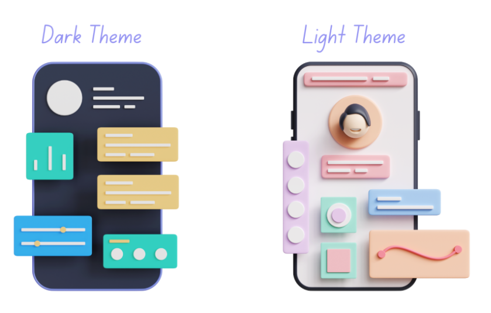

<h1 align="center"> 🧪 Test A/B de Thèmes pour une Application Web avec Python</h1>

De nombreuses plateformes web et applications utilisent des `tests A/B` pour mener des expériences et **déterminer** le meilleur design, **agencement** ou **thème** pour leur interface. Plutôt que de se fier à des suppositions ou à des intuitions, les applications et sites web peuvent tester différentes variations de design en temps réel auprès des utilisateurs afin de mesurer leur impact sur le comportement des utilisateurs et sur les métriques. En collectant et en analysant les données, ils peuvent identifier les éléments de design qui plaisent le plus aux utilisateurs et optimiser leur offre en conséquence. Si vous souhaitez savoir comment réaliser un test A/B pour choisir le meilleur thème pour un site web, cet article est fait pour vous. Dans cet article, je vais vous guider à travers la réalisation d’un test A/B de thèmes en utilisant Python.

## Test A/B de Thèmes : Aperçu

Le test A/B est une technique de `Data Science` puissante et largement utilisée pour comparer et évaluer des stratégies marketing, des designs, des agencements ou des thèmes. L'objectif principal du `test A/B` est de **prendre des décisions basées sur des données afin d'améliorer l'expérience utilisateur, d'optimiser les indicateurs de performance et, en fin de compte, d'obtenir de meilleurs résultats commerciaux**.

Prenons un exemple : une entreprise dispose de deux thèmes, le mode sombre et le mode clair. Elle souhaite déterminer lequel de ces thèmes est le plus apprécié sur son site web.

Pour déterminer quel thème est le meilleur, l'entreprise peut définir le thème clair comme thème par défaut du site web pendant une certaine période et recueillir des données sur la manière dont les utilisateurs interagissent avec le site. De même, elle peut définir le thème sombre comme thème par défaut pour la même période et comparer les données d'interaction des utilisateurs entre les deux thèmes afin de déterminer lequel a conduit à une meilleure interaction, à davantage d'achats, d'inscriptions, à une durée de session plus longue, et ainsi de suite.

Pour réaliser le test A/B des thèmes, nous avons besoin d'un ensemble de données sur l'interaction des utilisateurs avec deux thèmes ou modèles de design. J'ai trouvé un ensemble de données idéal pour cette tâche. Vous pouvez télécharger cet ensemble de données à partir de __[ce lien](https://statso.io/light-theme-and-dark-theme-case-study/)__.

- :man_technologist: **Résultats et Conclusion:** Pour consulter les résultats, ainsi que l'analyse détaillée et bien expliquée, veuillez vous référer au notebook `A-B_Tests.ipynb`.
